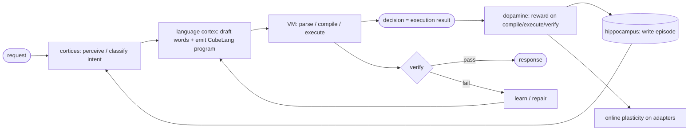
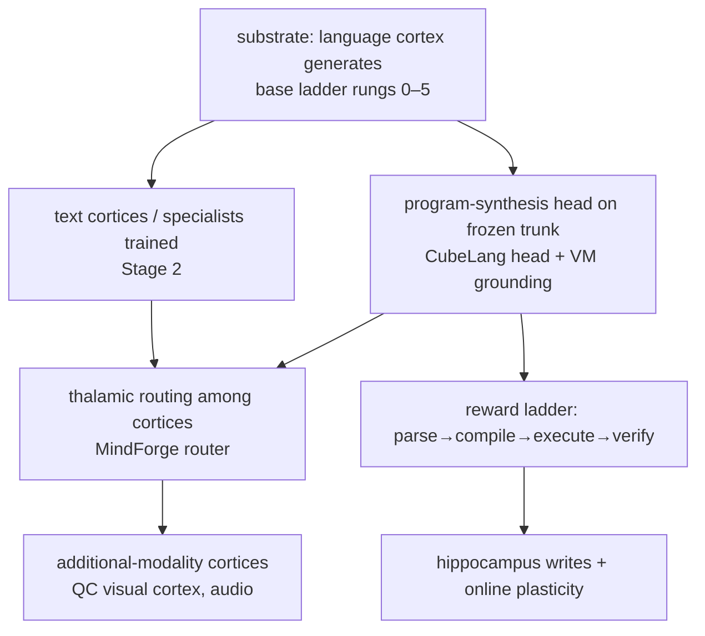

# Architecture — Cubby and the Neuro-Symbolic Agent

> Status: living design doc. Captures the target architecture and the disciplined
> build order derived from the v4 post-mortem. The base substrate (rung 0) is
> built and smoke-green in this repo; everything above it is staged, not yet built.

## 1. Thesis

The system is a **brain-inspired neuro-symbolic agent**. The language model
(Cubby) is **one cortex** — the language faculty. Its job is to interpret
requests/responses, generate words, and emit **programs**. The agent's actual
**decisions are grounded in a virtual machine** that executes auditable CubeLang
programs, not in the LM's opaque activations.

The split is the whole point:

- **Neural** half (cortices): fuzzy perception and proposal — classify intent,
  read context, draft language, emit a candidate program. Good at ambiguity,
  bad at guarantees.
- **Symbolic** half (VM): deterministic execution and verification — run the
  program, compute the decision, check it. Good at guarantees, auditable, and
  signed-off-able by a human.

A decision is therefore a program you can **read, trace, and verify**, not a
sample from a token distribution. That is the safety and reliability property
the architecture exists to buy.

## 2. The v4 lesson (why the rebuild)

v4 (`cubby_516m_v4`, 516M: MinGRU + sparse windowed attention + MoE + MTP + a
fixed-codebook **VSA word-vocab head**) reached val PPL ~7 but generated
degenerate text under both greedy and sampling. Root causes:

1. **The VSA binding head on the 65k word vocab.** Cosine readout against a
   fixed random ±1 codebook, fixed temperature (√d_vsa ≈ 101), untied
   embeddings → a low-rank softmax bottleneck + miscalibration that yields low
   teacher-forced CE but a fragile, attractor-prone free-running distribution.
2. **Everything-on-at-once.** A novel head, MoE + a hand-tuned PID balancer,
   MTP, sparse attention, and residual scaling all shipped together — the
   failure was unattributable.

The control that exonerates the recurrence: a 5.6M MinGRU with a **weight-tied
linear head** and everything else off reaches PPL ~7.26 and free-runs coherent
English. So MinGRU generates fine; the collapse came from what was layered on,
the VSA word head first among them.

## 3. Design principles

- **Tied-linear head for words.** Non-negotiable for the language cortex.
- **Recurrence-first MinGRU backbone**, ported verbatim from the version that
  generates.
- **One validated component at a time, at matched budget.** No stacking.
- **Measure the right thing.** Generation: rep-n / distinct-n / looping-rate /
  MAUVE alongside PPL. Programs: parse → compile → execute → `verify()` rate.
  PPL alone never reveals the v4 failure mode.
- **Near-identity at init for everything added.** Zero-init gates (episodic
  memory gate, MindForge `basis_B`, residual-scale α, IterAdaLN). A new
  component starts as a no-op and can only fade in if it helps.
- **No MTP during pretraining.** It hurt at 516M, consistent with the scaling
  literature (Gloeckle et al. 2404.19737; curriculum 2505.22757). MTP is
  decode-time only: a frozen self-speculative head post-training.
- **Auxiliary-loss-free MoE balancing** (DeepSeek-V3 / 2408.15664), not a PID.
- **VSA only where it belongs:** the small, structured opcode/VM space — never
  the word vocab.
- **Decisions ground in the VM.** The LM proposes; the VM disposes and verifies.

## 4. The brain map

| Biological role | Component | Function | Status / where |
|---|---|---|---|
| **Language cortex** | Cubby LM backbone (MinGRU + tied-linear head) | Interpret requests/responses, generate words, emit programs | Substrate — base ladder rungs 0–5 (rung 0 built) |
| **Thalamus** | MindForge router | Context-conditioned gate selecting *which* cortex/adapter fires | Stage 2 |
| **Cortices / specialists** | MindForge LoRA heads (opcode/intent/schema/rule/validity) + future modality cortices | Classify / specialize on the pooled features | Stage 2 |
| **Hippocampus (neural)** | Episodic memory layer (dopamine-gated KV, zero-init gate, every 4th layer) | Bias hidden states toward configs that reduced loss | Rung 2 |
| **Symbolic memory** | CubeLang `storage` / `remember` / retrieve | Inspectable key-value store the program reads/writes | In the VM (exists) |
| **VM (grounding)** | CubeLang VM / `opcode-vsa-rs` | Execute programs → deterministic, auditable decisions + verifiable QC | Exists; reasoning opcodes stubbed |
| **Dopamine** | Reward signal (loss improvement; compile/execute/verify success) | Drives memory writes + online plasticity | Partial (memory write hook) |
| **Neuromorphic substrate** | SNN / GIF neurons, HybridFFN | Spiking compute pathway | NumPy prototype — late research rung |
| **QC visual cortex** | Vision modality in the multimodal live brain | Perception/QC over a non-text modality | Later modality hookup |

The LM is one box in this table. Most of the agent's behavior — routing,
verification, decisions, symbolic memory — lives outside the network, in
programs and the VM.

## 5. The neuro-symbolic loop



Perception → proposal → **execution** → **verification** → reward → memory →
routing. The two arrows that make this more than a chatbot are **execution**
(the decision is a VM computation, not a token sample) and **verification**
(every program carries its own `verify()`, and compile/execute is ground truth).
Those are the QC of the system; "QC" is not one module, it is this loop.

## 6. The language cortex (Cubby)

Recurrence-first. The backbone is a stack of pre-norm residual blocks with a
MinGRU sequence mixer and a SwiGLU channel mixer, a final RMSNorm, and a
**weight-tied linear** output head.

MinGRU mixer (input-controlled, so the recurrence is linear and parallelizes
via a log-domain prefix scan):

```
g, v, d   = proj_g(x), proj_v(x), proj_d(x)     # proj_d.bias init = 1.0
x_scan    = sigmoid(g) * tanh(v)                 # candidate
a         = 0.001 + 0.998 * sigmoid(d)           # decay/retention gate
h_t       = a_t * h_{t-1} + x_scan_t             # parallel scan (Heinsen log-domain)
```

Block: `x = x + mix(norm(x)); x = x + ffn(norm(x))`. Head: `logits = (h @
embed.weightᵀ)`. SwiGLU: `W_out(silu(W_gate x) · W_up x)`.

### Ablation ladder

Every advanced component is flag-gated and off; unbuilt rungs raise rather than
silently no-op. Add one per rung, hold params/FLOPs/tokens fixed, score
generation (not just PPL) at each.

0. MinGRU + tied-linear + SwiGLU — **built, smoke-green**. Gate: coherent
   generation + PPL on TinyStories (reproduce the 5.6M baseline).
1. Scale to target dims (d=1024, L=18), still tied-linear, dense FFN.
2. + episodic memory injection (every 4th layer, zero-init gate). Gate: A/B at
   matched budget — looping-rate / coherence, not just PPL.
3. + sparse windowed causal attention (every 3rd layer).
4. + MoE (4 experts, top-2, shared) with auxiliary-loss-free bias balancing.
5. + sparse-FFN / FFN-parallelism.
6. MTP — **excluded from pretraining**; optional frozen speculative-decode attach.
7. + LoopMoE sandwich + IterAdaLN-style depth-conditioned modulation (research).
8. + corrected VSA head variants (learned temperature + learned codebook), LAST,
   each vs tied-linear at equal budget.

Rule: any rung that drops generation quality while PPL stays flat is quarantined
and understood before proceeding.

### v4 vs the rebuild baseline

| | v4 (failed) | rebuild rung 0 |
|---|---|---|
| params | ~516M | ~5–6M (scales to 516M at rung 1) |
| d_model / layers | 1024 / 18 | 256 / 6 |
| output head | VSA fixed-codebook, fixed τ, untied | weight-tied linear |
| MoE / attention / MTP | all on at once | all off |
| generation | degenerate (greedy + sampled) | coherent |

## 7. The LM↔VM bridge — program synthesis

`CubeLangHead` is the bridge. It is a **frozen-trunk** autoregressive decoder
(Stage-3 attachment) that emits a CubeLang **program token stream** conditioned
on a prompt:

- run the prompt through the frozen trunk, mean-pool over non-pad positions →
  a conditioning vector `c`;
- inject `c` at every decoder layer (input injection — keeps deep recurrence
  from washing out its input);
- teacher-force next-token CE over the program tokens; the trunk stays frozen
  (no grad), so this never perturbs the language cortex;
- share the trunk's output head by reference (tied `embed.weight`, or the VSA
  codebook if the trunk has one).

The interface as built is a **discrete program token stream** that the VM
parses. For discrete tokens, a tied-linear head over the full vocab (words +
opcode tokens) is sufficient and correct.

### Supervision ladder (the program-head reward)

The metric for this head is **not PPL** — it is how often the emitted program is
real:

```
token-CE  →  parses  →  compiles  →  executes  →  satisfies verify()
```

Per the existing discipline: compile/execute/verify enter as **eval metrics
first, then optional reward terms — never silently change the loss.** Production
decode is **grammar-masked** (constrained to the closed opcode grammar) so the
head cannot emit an invalid program.

**Train on the executing subset first.** `conversation_agent.cube` uses the full
rich surface (`match`, `for`, `struct`, `map`, methods, `atomic`); much of the
extended reasoning opcode set currently *traces but does not compute*
(CUBELANG_FIXES P0-1). If we train Cubby to fluently emit language the VM can't
run, compile/execute/verify stops being ground truth. So the LM's emission
target is the **executing subset**, grown in lockstep as the VM's reasoning
opcodes come online. Same measure-first discipline, applied to the neural↔symbolic interface.

### Where VSA belongs

- **Word vocab (65k):** tied-linear. VSA-as-readout here is the v4 failure.
- **Opcode/VM space (~tens of opcodes + roles, closed grammar):** VSA/HDC binding
  is strong — near-orthogonal codes separate trivially at that cardinality, and a
  shared codebook is what would let opcodes round-trip neural↔symbolic with the
  Rust VM (`opcode-vsa-rs` / `vsa_hash.rs`).

But the current bridge is discrete tokens, so VSA is **not required** for it.
VSA-as-readout only earns its keep if you want a **continuous neural↔VSA opcode
interface** (emit hypervectors binding directly to VM opcodes, skipping tokens);
if so, build it as a **dedicated opcode-VSA head on that small space**, never the
word head.

## 8. CubeLang and the VM

CubeLang is a typed, interface-bound language. Every program implements
`ISolver`: `parse` (raw → input), `solve` (input → output), `verify` (input,
output → bool), optionally `learn`. Programs carry persistent `storage`,
decorators (`@system @once`, `@external`, `@pure`, `@internal`), and ordinary
control flow.

- **Executing subset** (computes values today): `create`, `assign`, `add`, `sub`,
  `store`, `remember`, `query`, `sum`, `compare`, `if/else`. This is the
  ground-truth-verifiable core.
- **Extended reasoning opcodes** (`predict`, `match`, `score`, …): currently
  **trace but do not compute** (CUBELANG_FIXES P0-1). Target surface, not yet
  executable.

**Host shim contract** (the VM↔caller interface): `load(program)` → `init(...)`
→ inject inputs as registers → `call(program, fn, args)` → read `result()` +
`storage`. Perception outputs (e.g. a QC cortex's defect class + confidence) are
injected as registers; the VM computes the disposition deterministically.

Two examples bracket the design:

- **`qc_decision.cube`** — a narrow, deliberately safe-subset solver: perception
  (defect class + confidence) → deterministic, auditable disposition
  (PASS / REJECT / REVIEW), with audit counters in storage. The policy line is
  "the one line a plant manager signs off." Decisions are inspectable symbolic
  computations.
- **`conversation_agent.cube`** — the general reasoning template, and the more
  important one (QC is just one task). The **program is the reasoning**: parse →
  retrieve memory → classify intent → choose act → plan → detect risks → compose
  → verify → learn. `choose_act` is symbolic **routing**; `verify` is **QC**;
  `retrieve/remember/storage` is **symbolic memory**; `learn/classify_error` is
  **error-driven plasticity**; `detect_risks` makes **safety** first-class;
  `trace` + `event`s give auditability. The LM supplies the fuzzy classification
  and the language surface; the program does the hard control.

## 9. Memory — two complementary systems

Keep these distinct; they are not the same mechanism.

- **Neural episodic (hippocampus, rung 2).** A dopamine-gated key-value store of
  detached hidden states. On training steps where loss improved, it writes the
  sequence-mean hidden state tagged with the improvement; reads retrieve top-k by
  `cosine × utility`, blend, and inject through a **zero-init gate** at every
  4th layer; periodic consolidation merges/decays/prunes. Only the gate is
  trained. As ported it is a **coarse global context bias** (batch-row-0 mean,
  broadcast to all positions/examples), not per-token recall — most likely it
  helped as a mild prior/regularizer. Caveats for the rebuild: it's CPU-resident
  with a per-layer round-trip (a throughput tax at scale → reimplement
  GPU-resident), and it's external state **not in the checkpoint** (persist it).
- **Symbolic (CubeLang `storage` / `remember` / retrieve).** An inspectable
  key-value store the *program* reads and writes. Deterministic, auditable, and
  part of the decision trace.

The neural memory biases how the cortex thinks; the symbolic memory is data the
program reasons over. Both exist; they complement rather than replace each other.

## 10. Routing — thalamus and specialists

Today the multitask runtime fires **every** head unconditionally. The thalamus
role is the missing piece: a **context-conditioned gate that selects which
cortex/adapter fires** and suppresses the rest. MindForge is the natural fit —
it already forges a per-context adapter from a context vector, so making it
*route* is a small extension, and `basis_B` zero-init means the relay starts as
a passthrough.

Three mechanisms that must stay separate and be validated independently — they
fail differently:

1. **Token-level sparse MoE** (backbone FFN experts) — capacity/efficiency, per
   token. Base ladder rung 4. *Not* "specialists" in the domain sense.
2. **Specialist/task router** (the "specialists MoE at the input") — a
   sequence-level classifier choosing the domain. A supervised routing head.
3. **Routed MindForge adapters** (LoRA-MoE) — the router picks/weights which LoRA
   adapter applies.

Stacking all three is three routing decisions per forward; routing is the
hardest thing to keep stable in MoE (dead experts, load collapse, router
degeneration), and a hierarchy multiplies those failure modes. Build one routing
level at a time, each measured before the next.

### MindForge (the adapter mechanism)

A hypernetwork-forged LoRA head: from a context vector it forges a per-sample
low-rank `(A, B)` by mixing a shared basis, adds the delta on a base linear.
`basis_A` is a structural prior (offline only); **`basis_B` is zero-init and
plastic** — the only parameter updated by inference-time NLMS, so online learning
can't destabilize the base. That zero-init is what makes adding a specialist safe:
a fresh adapter is an exact no-op, validated to lift its task without regressing
the LM or other tasks. Current heads are classification (opcode/intent/schema/
rule/validity). Whether adapters should also **specialize generation** (feed the
residual/logits, not just emit a label), and whether routing is **per-sequence**
or **per-token**, are open design choices (§13).

## 11. Build order — the dependency DAG

The order is forced by the architecture, not by caution: a thalamus with no
trained cortices to route to is inert; cortices with no substrate that produces
usable features are inert; the substrate is the LM, which must generate first.



Attachments sit on a converged, frozen trunk in the locked order
(`pretrain → speculative-decode → adapter bank → CubeLang → looped → arena`).
None of Stage 2/3 touches the base pretraining ladder — they ride on top of a
trunk that already generates.

## 12. Metrics

- **Language (every rung):** rep-n, distinct-n, looping-rate, MAUVE, val PPL.
  PPL is necessary but not sufficient — it does not reveal the v4 collapse.
- **Programs (the bridge head):** parse rate → compile rate → execute rate →
  `verify()`-pass rate. (Trajectory tracked historically: 13% → 46% → 58%
  compile on `multitask_combined_v3_clean.jsonl`.)
- **Routing:** expert/specialist load balance, routing accuracy vs labels.
- **Memory:** A/B delta on looping-rate and coherence (its hypothesized win),
  not just PPL.

## 13. Component status

| Component | State |
|---|---|
| Cubby backbone (rung 0: MinGRU + tied-linear + SwiGLU) | **Built, smoke-green** (this repo) |
| Generation + metrics harness (rep-n / distinct-n / looping-rate) | **Built** (this repo) |
| Corrected VSA head (learned temp + learned codebook) | Present, off by default (rung 8) |
| Episodic memory (hippocampus) | Ported in `cubemind`; to reproduce as rung 2 (GPU-resident + checkpointed) |
| CubeLang program head | Scaffold in `cubemind` (decoder + frozen-trunk + token-CE done; reward ladder + constrained decode stubbed) |
| MindForge LoRA heads + multitask wrapper | Built in `cubemind` |
| CubeLang VM + language | Examples + bridge exist; executing subset works; reasoning opcodes stubbed (P0-1) |
| Specialist router / thalamus | Not built (runtime fires all heads) |
| SNN / HybridFFN | NumPy prototype; needs PyTorch + surrogate-gradient reimpl (late research rung) |
| Multimodal cortices (QC visual) | In the multimodal `live_brain`; later hookup |

## 14. Open questions

- **Memory "worked very well" — which metric?** PPL, less-looping generation,
  faster convergence, or long-context retention? Sets the rung-2 gate and whether
  the batch-0-broadcast version suffices vs per-example / GPU-resident retrieval.
- **MindForge adapters: classify or generate?** Emit task labels (today) or
  specialize the generative pathway (feed residual/logits)? The latter is a
  bigger, unbuilt change.
- **Specialist routing granularity:** per-sequence (clean supervised router) or
  per-token (another MoE, harder to stabilize)?
- **Neural↔VM interface:** stay discrete tokens (current; tied-linear sufficient)
  or add a continuous VSA opcode bridge (then a dedicated opcode-VSA head)?
- **Multimodal scope:** is the QC visual cortex near-term, or does the rebuild
  stay text + program/VM until the substrate is solid?

---

*Immediate next step: build the trainer (`data.py` + `train.py`) and clear rung 0
on TinyStories — coherent generation + PPL — since the substrate is the one thing
every box above depends on.*


---

## Afferent input gate (the input layer)

Every input enters through a **spiking-perceptron triage gate** before it reaches
the trunk. This is the system's afferent front-end, modeled on the dual-pathway
(LeDoux) split between a fast subcortical threat route and a slower cortical
appraisal route.

### Two paths

1. **CNS reflex path** — when the gate's salience/threat score crosses
   `gate_stress_threshold`, the input is escalated to the CNS (`live_brain`:
   amygdala + 5-hormone neurochemistry). This is an *interrupt*: it pre-empts the
   cortical router so urgent / high-stress input is handled by the reflex system
   first, the way a startle response precedes deliberation.

2. **Cortical router path** — otherwise the input goes to the router, which
   classifies it along `gate_route_axes` = {modality, tone, intent, domain} and
   dispatches it to the WorldManager **specialist** that owns that regime. If no
   specialist owns it (`gate_spawn_on_missing_specialist`), the router triggers a
   Hebbian expert-on-demand spawn (0.0.4) and registers the new specialist's
   block-code with the arena, so the next input in that regime already has an
   owner.

### Why a spiking perceptron

The gate must be cheap, always-on, and event-driven — it scores *every* input.
An SNN perceptron is the natural fit: sparse spikes, no dense matmul per token,
and it shares substrate and tooling with `live_brain` (grilly-backed, `brain/`).
The threat score is read from the perceptron's spike-rate / synchrony, not a
dense softmax.

### Dependencies and placement

The gate is the integrated **input layer**, but it can only do its job once the
things it routes to exist: the **CNS** (`live_brain`, present), the **router**
(MoE routing, 0.0.3), and **specialists** (Hebbian growth + WorldManager,
0.0.4). It is therefore the first system-integration milestone, **0.1.0**, not a
trunk rung. For substrate tests (0.0.0) it is bypassed — raw tokens go straight
to the trunk — and `enable_input_gate` stays False until 0.1.0.

### Config knobs
- `enable_input_gate` — off until 0.1.0
- `gate_snn_hidden` — spiking perceptron hidden width (default 256)
- `gate_stress_threshold` — threat score that escalates to the CNS (default 0.7)
- `gate_route_axes` — {modality, tone, intent, domain}
- `gate_spawn_on_missing_specialist` — spawn a specialist for an unowned regime


---

## Observability & audit (cross-cutting — applies to every rung)

**Hard requirement:** every step, even the smallest, is **auditable** and
**visualizable** — in real time per example (which neuron fires lights up) and
captured inside tests for debugging. This is not a feature of one rung; it is an
invariant baked into the substrate from `0.0.0`. The trunk forward writes to
`cubby.trace` from line 1.

### The trace bus (`cubby/trace.py`)

Every component writes named records to the *active* `Tracer`. One record = one
atomic step: the units/neurons involved, their activations, plus typed events
(routing decisions, expert spawns, gate escalations, VSA cosine hits). One stream
feeds both the live viewer and the test harness, so what you debug is exactly
what you watch.

Levels are a cost model, so full instrumentation is free in production:

| level | emits | use |
|---|---|---|
| `off` | nothing (probe returns before touching the array) | production |
| `audit` | scalar summaries (mean/std/absmax/nonzero_frac) + events | always-safe logging |
| `visual` | + per-unit intensities (0..1) / spike ids | real-time "lights up" |
| `full` | + full tensors | per-step parity debugging |

API: `trace.probe(component, x, topology=, unit_ids=)` for activations,
`trace.spikes(component, neuron_ids, topology=)` for SNN firing (the ids *are*
the payload), `trace.event(component, name, **meta)` for decisions. Nesting via
`with trace.scope("trunk"), trace.scope("layer3"):` and `trace.set_step(i)` per
example/token. Activate with `with trace.trace_to(sink, level): ...`.

Sinks: `MemorySink` (tests), `JsonlSink` (audit log / real-time tail),
`CallbackSink` (in-process viewer hook), `FanoutSink` (several at once).

### Real-time visualization contract

A `visual`-level record carries `unit_ids` + `intensities` (normalized 0..1) and
a `topology` tag (`"layer:3"`, `"grid:8x8"`, `"expert:2"`) that tells the viewer
how to place the units. SNN records carry spike ids directly. The viewer (and the
GRL live-brain demo) tails the JSONL stream or subscribes via `CallbackSink` and
lights up the corresponding units — no separate instrumentation path.

### Test contract

Tests run at `audit`/`full` and assert on the trace, not just the final output:
golden traces are captured once, then `trace.diff_report` / `trace.max_step_diff`
report the **first divergent step** (scope + component + absmax_diff). A parity
test therefore says *which layer* broke, not merely that the output differs. See
`cubby/test_trace.py` for the reference pattern; every component test follows it.

### Standing gate

No rung is "done" until: (1) each new step emits a trace record, (2) those
records render in the viewer, and (3) a test asserts on them. Auditability is
part of the definition of done, alongside parity and generation quality.
